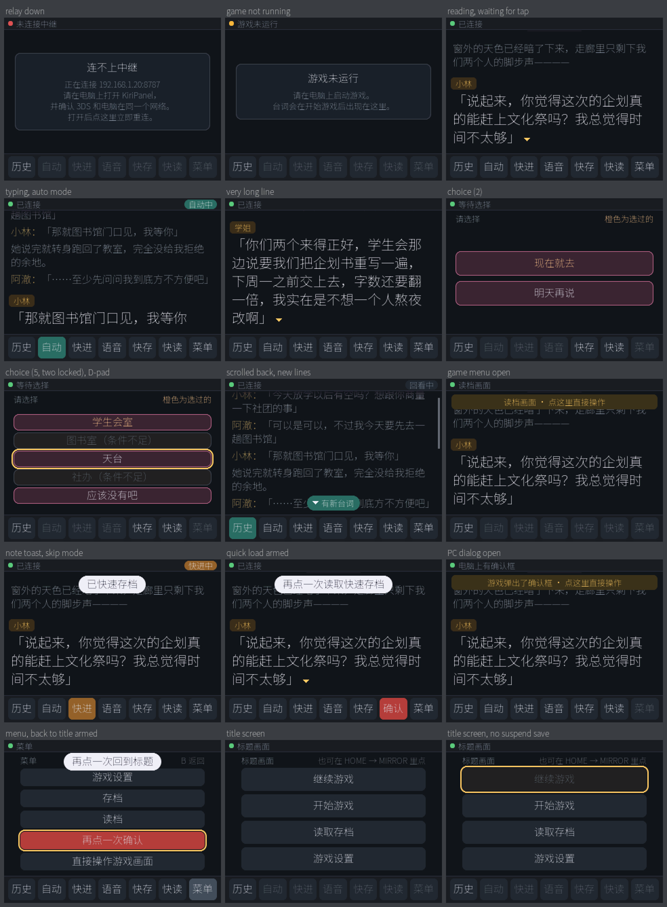

# KiriPanel

[](https://github.com/5blockhitme3time/kiripanel-3ds/actions/workflows/ci.yml)
[](https://github.com/5blockhitme3time/kiripanel-3ds/releases)
[](LICENSE)
[](#玩家快速开始)

把吉里吉里（KiriKiri）galgame 搬到 New 3DS 上玩：**上屏是 Moonlight 串流的游戏画面，
下屏原生显示台词**——说话人、历史、选项都在下面，点一下就能前进、选择、自动、快进、
快存快读、打开存读档和设置、回到标题。电脑上游戏自己的对话框可以自动隐藏，
免得上下屏重复显示一遍文字。

游戏侧是一个通用插件：**不改游戏自己的任何文件，只往游戏目录里加文件**，
一键安装、一键卸载；**只调用游戏自己的函数，不模拟鼠标键盘**。

```
┌─────────────── PC ───────────────┐          ┌──── New 3DS ────┐
│  游戏 (KiriKiri)                  │          │  ┌───────────┐  │
│   └ version.dll (KiriPanel 插件)  │          │  │ 上屏      │  │
│      └ kiripanel/*.tjs  钩子      │  串流    │  │ Moonlight │  │
│         ↕ _hkstate/_hkcmd.ksd     │ ───────► │  └───────────┘  │
│  KiriPanel.exe (中继 + 管理窗口)  │  HTTP    │  ┌───────────┐  │
│   └ relay.py  127.0.0.1 + :8787   │ ◄──────► │  │ 下屏      │  │
└───────────────────────────────────┘          │  │ 台词面板  │  │
                                               │  └───────────┘  │
                                               └─────────────────┘
```



## 玩家快速开始

1. **3DS 端**：把 `3DS/moonlight.3dsx` 放到 SD 卡的 `/3ds/`，用 Homebrew Launcher 打开；
   或者用 FBI 安装 `3DS/moonlight.cia`。第一次打开时和普通 Moonlight 一样选电脑、配对。
2. **电脑端**：双击 `KiriPanel.exe` → 「＋ 添加游戏」选游戏文件夹 → 选中游戏 →「一键安装」。
   拿不准能不能用就先点「检测兼容性」（会用一个空的临时存档启动一次游戏，不碰你的存档）。
3. **每次玩**：开着 KiriPanel，照常启动游戏，3DS 上打开 Moonlight 串流电脑桌面或游戏。
   下屏自动变成台词面板。

完整的图文说明（安装、按键、支持分级、排错）在 [`docs/player_guide.txt`](docs/player_guide.txt)，
打包时会转成 `使用说明.txt` 一起发布。

### 支持到什么程度

不是所有吉里吉里游戏都能用，KiriPanel 的「检测兼容性」会给出分级：

| 分级 | 含义 |
|---|---|
| 完整支持 | 有专门的适配器：台词、选项、自动/快进、快存快读、游戏菜单、回标题、隐藏电脑对话框 |
| 基本支持 | 通用 KAG3 适配器：台词/人名、`[link]` 选项、前进、自动、快进、回标题、隐藏对话框；游戏自己的存读档/设置画面照搬到下屏直接点 |
| 需要适配器 | 插件能在游戏里跑起来，但还没有适配器认识它（可以导出诊断报告来写适配器） |
| 需经启动器 | 这个程序只是启动器，要在「启动用」里选它 |
| 不支持 | 插件挂不进去（不加载任何插件 / 加了壳 / 自带的 version.dll 和 mpr.dll 都已占用） |

实测覆盖 KiriKiri Z 1.3.x 与 KiriKiri 2、32 位与 64 位引擎，包括柚子社、Frontwing 等
使用「KAG Ex」系统的吉里吉里Z游戏、标准 KAG3 游戏、经汉化启动器启动的游戏。

## 它是怎么工作的

**插件怎么进游戏。** 见过的每个吉里吉里引擎都导入 `version.dll` 和 `mpr.dll`，
而 Windows 优先在 exe 目录找这两个名字的 DLL。插件就是同名代理：转发系统 DLL 的全部
导出（导出表由 `gen_proxy.py` 从系统 DLL 生成，16 字节跳转桩，不重复写函数签名），
并挂钩 `kernel32!GetProcAddress`——引擎向自己的插件查询 `V2Link` 时，拿到的是一段
thunk：先把引擎的函数导出表交给 KiriPanel，再**跳**到真正的 `V2Link`（保持引擎的返回地址，
有些插件的 V2Link 会检查调用者）。之后就是普通 tpm 的流程：用 `tp_stub` 执行一段 TJS，
等 `global.kag` 就绪后加载 `kiripanel/hook.tjs`。自带 `version.dll` 的游戏改用 `mpr.dll`；
一个插件都不加载的游戏挂不上去（日志里会说明）。

**钩子分成核心与适配器。** `core.tjs` 与游戏无关：状态文件、命令队列、存档保护、
用图层 opacity 隐藏对话框（包装 `kag.internalStoreFlags/internalRestoreFlags`，所以存档不会
把隐藏状态存进去）、错误上报。`adapter_*.tjs` 认识具体的游戏：按 `detect()` 的得分选最高分的
一个，一直报错就丢掉它（游戏不受影响）。游戏侧的文件跟中继共用同一套 `saveStruct` 读写。

| 适配器 | 面向 | 用到的入口 |
|---|---|---|
| `kagex` | KAG Ex 框架（krkrz 1.2 与 krkr2） | `Current._now`、`kag.historyLayer.data`、`kag.selectLayer`、`SystemAction._*` |
| `kag3` | 任何 KAG3 | `historyLayer.store`（包装）、`tagHandlers.ch/link`、`enter/cancelAutoMode`、`skipToStop`、`goToStart`、`systembutton_object`、`askYesNo` |
| `koihazi` | 开发商自建的回想/选项/存档/标题系统 | `tf.BL_Data`、`systembutton_object`、`TxSL_Process`、`BM.BookMark`、`TI.Title`、`f.NowLocate` |

**3DS 端**是 [Moonlight-N3DS](https://github.com/zoeyjodon/moonlight-N3DS) 的 fork：
`src/panel` 是下屏面板（自带 FreeType 光栅化与内置 CJK 字体子集），`src/relay` 是与
`relay.py` 之间的 HTTP 轮询客户端。命令走反向：3DS → `/cmd` → 中继写 `_hkcmd.ksd` →
钩子 `Scripts.evalStorage` 读 → **只调用游戏自己的函数**。协议见
`src/relay/relay_protocol.hpp` 和 `pc/kiripanel/relay.py` 的文件头。

## 仓库结构

| 路径 | 内容 |
|---|---|
| `plugin/native/` | 游戏内插件（C++）：`build.bat` 一次编出 `version.dll` / `mpr.dll` / `kiripanel.tpm`，32 与 64 位 |
| `plugin/hook/` | TJS 侧：`hook.tjs`（入口）、`core.tjs`、`adapter_*.tjs`、`scout.tjs` |
| `pc/kiripanel/` | PC 侧：`relay.py`（中继）、`install.py`、`games.py`、`compat.py`、`app.py` + `ui.html`（管理窗口） |
| `pc/build.py` | 打包成 `dist/KiriPanel/`（KiriPanel.exe + 3DS 端 + 使用说明） |
| `console/moonlight-n3ds/` | Moonlight-N3DS 的 fork（子模块），面板在 `src/panel`、`src/relay` |
| `console/panel_preview/` | 在 PC 上原生编译面板：跑测试（ASan）并输出上面那张预览图 |
| `console/fonts/` | 内置字体子集：GB2312 + Big5 一级 + JIS X 0208 + 符号，约 1.2 万字 |
| `dev/` | 开发工具（见下） |
| `docs/player_guide.txt` | 玩家说明（打包时转成 `使用说明.txt`） |

## 自己编译

**游戏内插件（Windows + MSVC）**

```bat
plugin\native\build.bat            :: x86 和 x64 都编
plugin\native\build.bat x86        :: 只编一种
python plugin\native\proxytest.py plugin\native\out\x64\version.dll
```

`gen\` 里的导出表由 `python plugin\native\gen_proxy.py version mpr` 从本机系统 DLL
重新生成（换 Windows 版本后可以再跑一次）；`build.bat` 用 `vswhere` 找 Visual Studio，
也可以用环境变量 `VCVARS` 指定 `vcvarsall.bat`。

**PC 端**

```bat
python -m unittest discover -s pc\tests
python pc\build.py                 :: 需要先编好插件；打包成 dist\KiriPanel\
```

**3DS 端**（需要 devkitPro + devkitARM，以及 freetype/libpng 等 portlibs；
上游的 `Dockerfile` 装了全部依赖，CI 就是用它编的）

```bash
cd console/moonlight-n3ds
make -j$(nproc)                    # make DIAG=1 会额外在 SD 卡上写每秒的计时日志
```

**面板本体**（在 PC 上原生编译，不用 3DS 工具链）

```bash
wsl bash console/panel_preview/build.sh    # 96 项测试（ASan）+ docs/images 那张预览图
```

## 测试

| 测什么 | 怎么跑 |
|---|---|
| PC 单元测试（55 项） | `python -m unittest discover -s pc/tests` |
| 真游戏回归：5 个场景走面板命令 | `python dev/regress.py` |
| 通用 KAG3 适配器（4 个场景） | `python dev/regress.py kag3_story kag3_title kag3_screens kag3_dialog` |
| 面板（96 项，ASan） | `wsl bash console/panel_preview/build.sh` |
| 命令行兼容性检测 | `python dev/compatrun.py GAME_DIR` |
| 给新游戏写适配器 | `python dev/probe.py start GAME_DIR`，然后用 `eval` / `shot` / `src` 探索 |

回归测试用的游戏路径放在 `dev/testgames.json`（**不入库**，格式见
`dev/testgames.example.json`），也可以用环境变量 `KIRIPANEL_TEST_EXE`、`KIRIPANEL_KAG3_GAME`。

测试绝不碰玩家真实存档：`-datapath` 指向副本或空目录；唯一一个不认 `-datapath` 的启动器
会先把 `savedata` 按字节备份、结束后原样恢复。

CI（GitHub Actions）每次提交会跑：Windows 上编插件 + PC 单元测试、Linux 上编面板
（ASan）跑 96 项测试、Docker 里编 3DS 端。打 `v*` tag 会自动发 Release，附件里是
`KiriPanel-<版本>.zip`（玩家下载包）和 3DS 端的 `.3dsx` / `.cia`。

## 写一个新适配器

1. `python dev/probe.py start GAME_DIR` 启动游戏（会临时装上开发用插件），用
   `probe.py eval "表达式"`、`eval -f`、`shot`、`src 文件名`（游戏自己读到的脚本）
   来探索全局对象、图层树、消息层。
2. 让插件跑一次 `scout`（或在管理窗口点「导出诊断报告」）：全局对象成员、插件列表、
   图层树、疑似回想/选项/系统按钮的对象都会列出来。
3. 照 `plugin/hook/adapter_base.tjs` 的说明写 `adapter_xxx.tjs`，`detect()` 给分，
   `core.tjs` 会自动选中它。
4. 踩过的坑：只在 `kag.inStable` 的时候按键，而且要走按钮自己的 `onExecute`，
   不要用 `processLink`；TJS 的 `incontextof global` 之后看不到外层局部变量；
   子串是 `substring(start, len)`。

细节见 [CONTRIBUTING.md](CONTRIBUTING.md)。

## 已知限制

- **旧 3DS / 2DS 跑不动**串流，需要 New 3DS / New 3DS LL。
- 中继没在跑的时候，3DS 每次连接尝试都会占住串行的 SOC 服务、把串流卡住一下，
  所以中继一直连不上时客户端会自动拉长重试间隔（下屏点一下卡片可以立即重试）。
- 3DS 端的 `3dsx`/`cia` 与 Moonlight-N3DS 上游同名同 ID（`Moonlight`，`0x3600`），
  会覆盖已装的上游版本（配置目录共用，配对信息不丢）。
- 快存/快读只在游戏自己提供时才有；纯 KAG3 游戏没有统一的快存。
- 游戏自己的存读档、设置画面是满屏鼠标界面，面板进入时自动切成「镜像」直接操作。

## 字体（可选）

把一个完整字体的 `font.ttf` / `font.ttc` / `font.otf` 放到 SD 卡
`/3ds/moonlight/kiripanel/`，内置子集缺的字就会用它显示（按需读取，不占内存）。

## English

KiriPanel plays KiriKiri (吉里吉里) visual novels on a New 3DS: the game streams to
the top screen through [Moonlight-N3DS](https://github.com/zoeyjodon/moonlight-N3DS),
and the bottom screen shows the dialogue natively — text, speaker, backlog and
choices — with buttons that drive the game **through its own functions** (no mouse
or keyboard simulation). The game side is a generic KiriKiri plugin that adds files
next to the game's exe and changes none of them: a `version.dll` / `mpr.dll` proxy
that hooks `GetProcAddress` to catch the engine linking its plugins, plus a TJS hook
split into a game-independent core and per-game adapters (KAG Ex, generic KAG3, and
one game's own systems). A manager program on the PC relays between the hook and the
console and installs/removes the plugin with one click.

See the sections above for the architecture, the repository layout, how to build and
test each part (PC plugin, PC side, 3DS app, native panel harness), and how to write
an adapter for a new game. Player documentation is
[`docs/player_guide.txt`](docs/player_guide.txt) (Chinese).

## 协议与致谢

本项目以 **GPL-3.0** 发布（因为 3DS 端是 Moonlight-N3DS 的 fork）。第三方组件与
各自的协议见 [THIRD_PARTY.md](THIRD_PARTY.md)。

- [Moonlight-N3DS](https://github.com/zoeyjordan/moonlight-N3DS)（GPL-3.0）：3DS 端串流
- [MinHook](https://github.com/TsudaKageyu/minhook)（BSD-2-Clause）：`GetProcAddress` 挂钩
- `tp_stub`（KiriKiri 2 源码，W.Dee）：允许编进插件使用
- [Noto Sans SC](https://fonts.google.com/noto)（SIL OFL 1.1）：内置字体子集的来源
- 本项目与各游戏、汉化组、Moonlight 官方均无隶属关系；请自备正版游戏。
